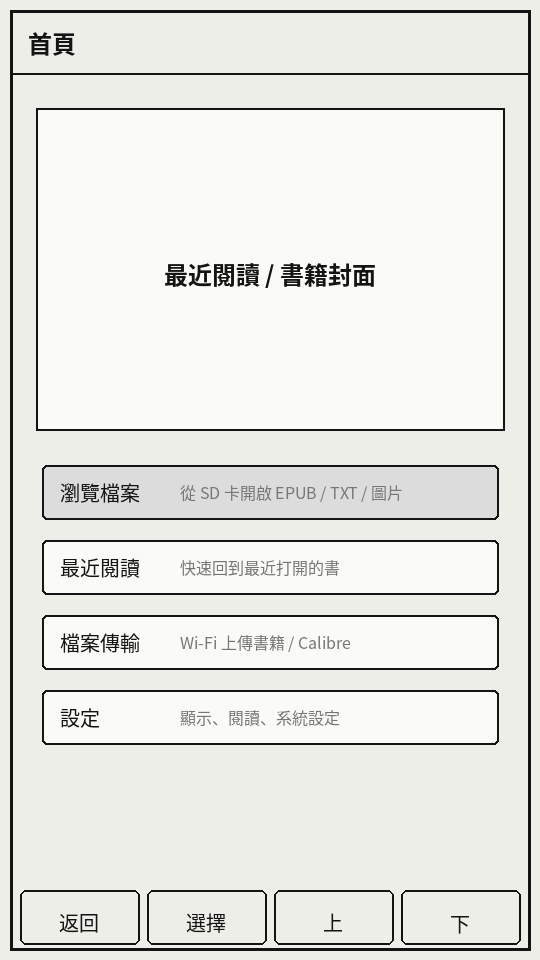
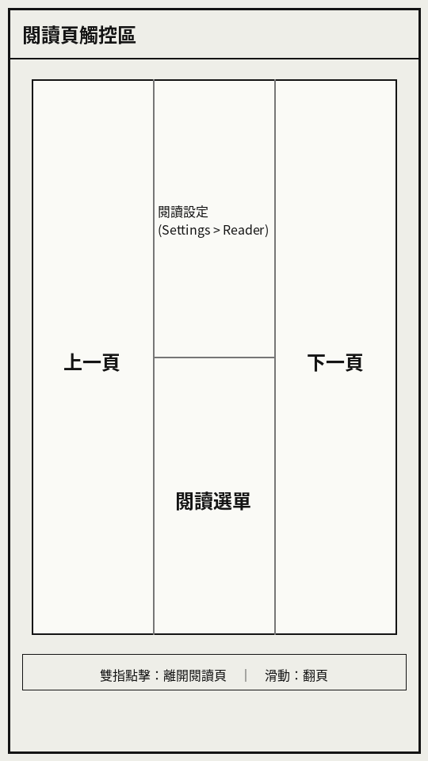
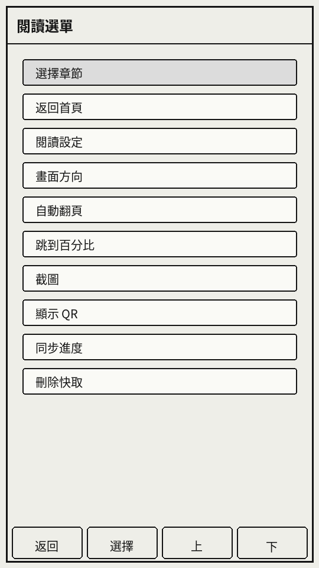
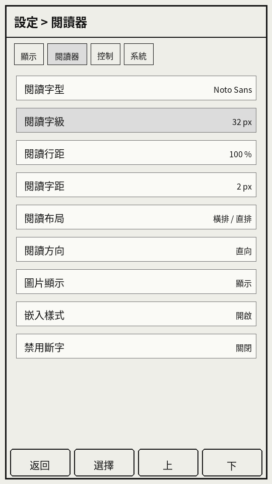
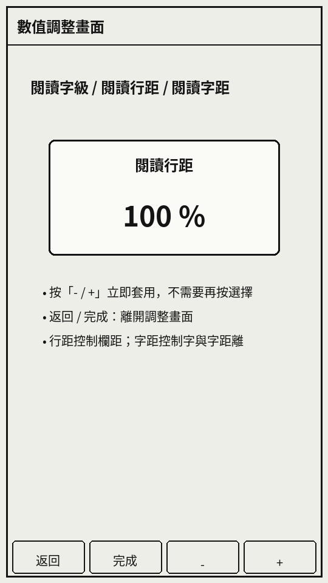

# PaperPoint S3 Reader 使用說明

PaperPoint S3 Reader 是給 **M5Stack Paper S3 / M5Paper S3** 使用的中文優先電子紙閱讀器韌體。主要用途是閱讀 EPUB、TXT、圖片，以及使用自訂休眠畫面。

## 1. 開始使用

### SD 卡資料夾建議

```text
/books/        EPUB、TXT、圖片檔
/fonts/        選用的外部 TTF / OTF / BIN 字型
/.sleep/       自訂休眠圖片
/.crosspoint/  系統自動建立的快取資料
```

即使沒有放外部中文字型，本韌體也內建繁體中文 fallback，可顯示中文 UI、書名、章節與正文。

### 支援格式

| 類型 | 副檔名 | 備註 |
|---|---|---|
| 電子書 | `.epub` | 支援 EPUB 2/3，中文直排與橫排 |
| 文字 | `.txt` | 適合純文字小說 |
| 圖片 | `.bmp`, `.jpg`, `.jpeg`, `.png` | 可作為瀏覽圖片或休眠圖 |
| 字型 | `.ttf`, `.otf`, `.bin` | 放在 `/fonts/`，可於閱讀設定選擇 |

## 2. 首頁

首頁可進入檔案瀏覽、最近閱讀、檔案傳輸與設定。



底部四個按鍵區在多數非閱讀畫面都有效：

| 按鍵 | 功能 |
|---|---|
| 返回 | 回上一層或離開目前畫面 |
| 選擇 / 切換 | 開啟項目、確認或切換設定 |
| 上 | 選取上一項 |
| 下 | 選取下一項 |

## 3. 檔案瀏覽與最近閱讀

在首頁選擇 **瀏覽檔案** 可從 SD 卡開書；選擇 **最近閱讀** 可回到最近開啟過的書。建議將書籍放在 `/books/`，但韌體也可以瀏覽 SD 卡其他資料夾。

檔案瀏覽器已針對 Paper S3 做局部刷新，移動選取列時只重畫新舊選取列，減少電子紙等待時間。

## 4. 閱讀頁觸控區

閱讀頁不顯示底部按鍵，而是使用全螢幕觸控區。



| 區域 / 手勢 | 功能 |
|---|---|
| 左側 | 上一頁 |
| 右側 | 下一頁 |
| 中間偏上 | 直接進入「設定 > 閱讀器」 |
| 中間偏下 | 開啟閱讀選單 |
| 雙指點擊 | 離開閱讀頁 |
| 向上 / 向下滑動 | 翻頁 |

## 5. 閱讀選單

在閱讀頁點中間偏下，可開啟閱讀選單。



常用項目：

| 項目 | 功能 |
|---|---|
| 選擇章節 | 開啟章節目錄，可跳到指定章節 |
| 返回首頁 | 離開目前閱讀頁，回首頁 |
| 閱讀設定 | 進入閱讀器設定頁 |
| 畫面方向 | 切換閱讀方向 |
| 自動翻頁 | 設定每分鐘翻頁速度 |
| 跳到百分比 | 跳到書籍進度百分比 |
| 截圖 | 儲存目前畫面截圖 |
| 同步進度 | KOReader Sync 進度同步 |
| 刪除快取 | 清除目前書籍快取並重建 |

## 6. 閱讀器設定

從首頁進入 **設定 > 閱讀器**，或在閱讀頁點中間偏上可直接進入。



常用設定：

| 設定 | 說明 |
|---|---|
| 閱讀字型 | 選擇內建字型或 `/fonts/` 外部字型 |
| 閱讀字級 | 以 px 數字調整正文大小 |
| 閱讀行距 | 以百分比調整橫排列距與直排欄距 |
| 閱讀字距 | 以 px 調整文字間距，直排時影響同欄字距 |
| 閱讀布局 | 橫排 / 直排 |
| 圖片顯示 | 顯示圖片、只顯示佔位、或隱藏圖片 |
| 嵌入樣式 | 是否使用 EPUB 內建 CSS 樣式 |
| 禁用斷字 | 控制英文斷字行為 |

### 數值調整畫面

字級、行距、字距會進入獨立調整畫面，用 `- / +` 修改。修改後會立即寫入設定，不需要再按「選擇」才套用。



建議初始值：

| 項目 | 建議值 | 說明 |
|---|---:|---|
| 閱讀字級 | 30–34 px | Paper S3 直向閱讀較舒服 |
| 閱讀行距 | 100% | 橫排列距 / 直排欄距的基準 |
| 閱讀字距 | 0–2 px | 想要緊密可用 0 px，想要舒適可用 2 px 以上 |

## 7. 中文直排與圖片

直排模式下，圖片預設會單獨置中成頁，避免圖片壓縮同頁文字高度，造成跨頁欄高不一致。

```text
文字頁 → 圖片頁 → 文字頁
```

這種方式會多一些頁數，但直排閱讀穩定性與版面一致性較好。

## 8. 休眠圖片

自訂休眠圖片放在：

```text
/.sleep/
```

支援 `.bmp`, `.jpg`, `.jpeg`, `.png`。不透明圖片會保持比例後中央裁切填滿畫面；透明 PNG 會保持完整比例置中，透明區域可露出目前閱讀頁或白色背景。

## 9. 快取與效能

韌體會把 EPUB 章節、圖片與閱讀進度快取到：

```text
/.crosspoint/
```

快取可讓第二次開啟同章更快。若更換字級、行距、字距、閱讀布局或圖片設定，章節快取會自動失效並重建。

如果遇到舊版快取造成顯示異常，可在設定內清除閱讀快取，或手動刪除 SD 卡的 `/.crosspoint/`。

## 10. Wi‑Fi 傳輸與 OTA

首頁的檔案傳輸可啟動 Wi‑Fi 上傳頁面。OTA 更新與 KOReader Sync 也需要 Wi‑Fi。這些網路功能保留自 CrossPoint Reader 架構，目前 Paper S3 版本仍建議視為進階 / 實驗功能，發布前請以實機再測。

## 11. 常見問題

### 中文變成方塊或缺字

先確認是否刷入含內建中文字型的版本。若使用外部字型，請確認字型放在 `/fonts/`，並在設定中選取。

### 開書後一直「正在建立索引」

第一次開啟、變更閱讀排版參數、或新版本提升 Section cache 版本後，章節會重新建立快取。後續再開同一章通常會變快。

### 圖片顯示成 `[Image: alt]`

可先清除該書快取再開啟。新版已避免背景預建章節時把暫時失敗的圖片 fallback 固化進快取。

### 想回到乾淨狀態

關機後取出 SD 卡，刪除：

```text
/.crosspoint/
```

再插回裝置開機。
