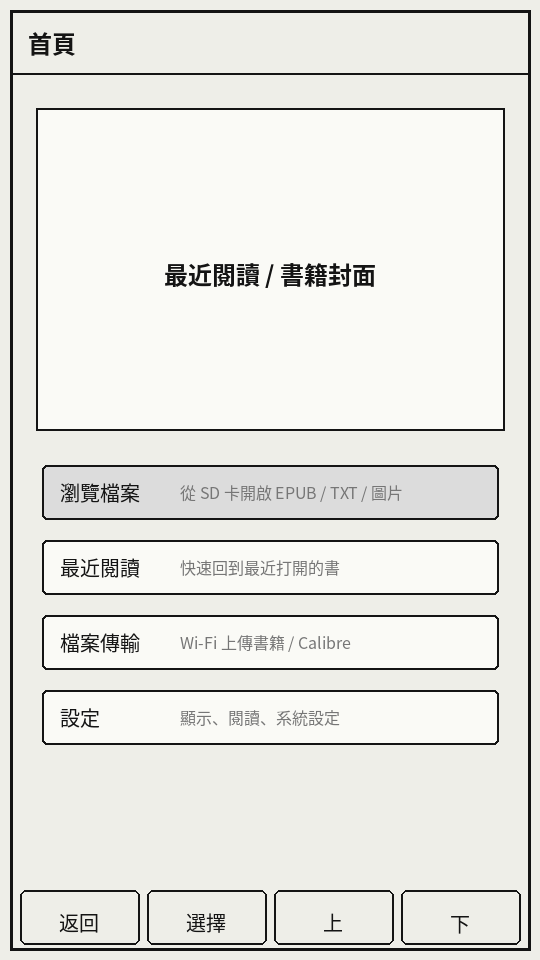
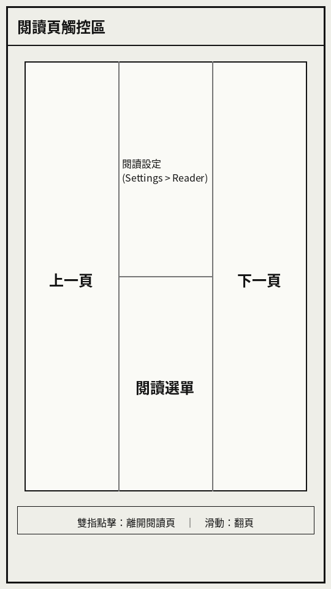
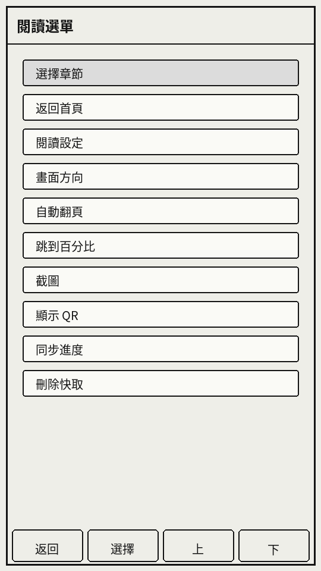
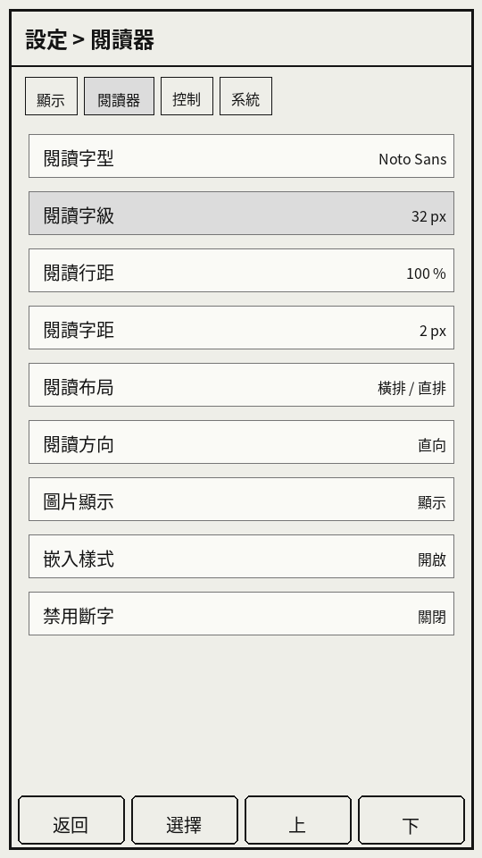
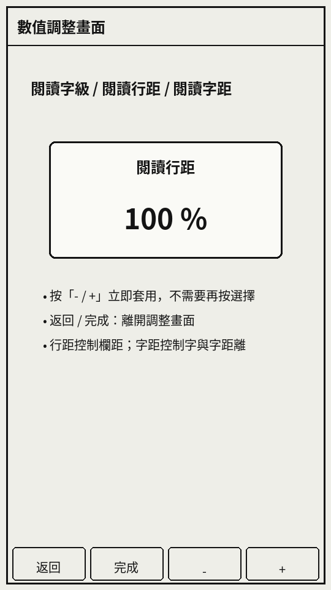

# PaperPoint S3 Reader 使用說明

PaperPoint S3 Reader 是給 **M5Stack Paper S3 / M5Paper S3** 使用的中文優先電子紙閱讀器韌體。主要用途是閱讀 EPUB、TXT、圖片，以及使用自訂休眠畫面。

## 1. 開始使用

### SD 卡資料夾建議

```text
/books/        EPUB、TXT、圖片或 CBZ/ZIP 漫畫
/font/         選用的外部 TTF / OTF / BIN 字型（優先）
/fonts/        選用的外部 TTF / OTF / BIN 字型
/bg/           閱讀內容背景 PNG
/.sleep/       自訂休眠圖片
/cover/        自訂休眠圖片
/.crosspoint/  系統自動建立的快取資料
```

即使沒有放外部中文字型，本韌體也內建繁體中文 fallback，可顯示中文 UI、書名、章節與正文。

### 支援格式

| 類型 | 副檔名 | 備註 |
|---|---|---|
| 電子書 | `.epub` | 支援 EPUB 2/3，中文直排與橫排 |
| 文字 | `.txt` | 適合純文字小說 |
| 圖片 | `.bmp`, `.jpg`, `.jpeg`, `.png` | 可作為瀏覽圖片、閱讀背景或休眠圖 |
| 漫畫 | `.cbz`, `.zip` | ZIP 內含 JPG/JPEG/PNG/BMP，依檔名自然排序 |
| 字型 | `.ttf`, `.otf`, `.bin`, `.epdf` | 放在 `/font/` 或 `/fonts/`，可於閱讀設定選擇 |

## 2. 首頁

首頁可進入檔案瀏覽、最近閱讀、檔案傳輸與設定。



底部四個按鍵區在多數非閱讀畫面都有效：

| 按鍵 | 功能 |
|---|---|
| 返回 | 回上一層或離開目前畫面 |
| 選擇 / 切換 | 開啟項目、確認或切換設定 |
| 前頁 | 移到上一頁清單或上一頁內容 |
| 後頁 | 移到下一頁清單或下一頁內容 |

首頁、設定分頁與多數清單項目也支援直接觸控點選；底部按鍵主要作為翻頁與輔助操作。

## 3. 檔案瀏覽與最近閱讀

在首頁選擇 **瀏覽檔案** 可從 SD 卡開書；選擇 **最近閱讀** 可回到最近開啟過的書。建議將書籍放在 `/books/`，但韌體也可以瀏覽 SD 卡其他資料夾。

檔案瀏覽器已針對 Paper S3 做局部刷新，移動選取列時只重畫新舊選取列，減少電子紙等待時間。

導覽規則：

- 每個非根目錄的第一列固定顯示 `..`，選擇後返回上一層。
- 短按實體或畫面底部「返回」：非根目錄回上一層；位於 SD 根目錄 `/` 時返回首頁。
- 長按「返回」約 1 秒：無論目前在哪一層，直接返回首頁。
- 返回上一層後會選中剛離開的資料夾，方便再次進入。
- 一般書籍瀏覽與漫畫檔案瀏覽使用相同規則。

## 4. 閱讀頁觸控區

閱讀頁不顯示底部按鍵，而是使用全螢幕觸控區。



| 區域 / 手勢 | 功能 |
|---|---|
| 左上角 64×64 | 隱藏關機熱區，不顯示圖示且優先於翻頁 |
| 左側 | 上一頁 |
| 右側 | 下一頁 |
| 中間偏上 | 直接進入「設定 > 閱讀器」 |
| 中間偏下 | 開啟閱讀選單 |
| 雙指點擊 | 離開閱讀頁 |
| 向上 / 向下滑動 | 翻頁 |

## 5. 閱讀選單

在閱讀頁點中間偏下，可開啟閱讀選單。



常用項目：

| 項目 | 功能 |
|---|---|
| 選擇章節 | 開啟章節目錄，可跳到指定章節 |
| 返回首頁 | 離開目前閱讀頁，回首頁 |
| 閱讀設定 | 進入閱讀器設定頁 |
| 畫面方向 | 切換閱讀方向 |
| 自動翻頁 | 設定每分鐘翻頁速度 |
| 跳到百分比 | 跳到書籍進度百分比 |
| 截圖 | 儲存目前畫面截圖 |
| 同步進度 | KOReader Sync 進度同步 |
| 刪除快取 | 清除目前書籍快取並重建 |

## 6. 閱讀器設定

從首頁進入 **設定 > 閱讀器**，或在閱讀頁點中間偏上可直接進入。



常用設定：

| 設定 | 說明 |
|---|---|
| 閱讀字型 | 選擇內建字型或 `/font/`、`/fonts/` 外部字型 |
| 閱讀字級 | 以 px 數字調整正文大小 |
| 閱讀行距 | 以百分比調整橫排列距與直排欄距 |
| 閱讀字距 | 以 px 調整文字間距，直排時影響同欄字距 |
| 閱讀布局 | 橫排 / 直排 |
| 圖片顯示 | 顯示圖片、只顯示佔位、或隱藏圖片 |
| 嵌入樣式 | 是否使用 EPUB 內建 CSS 樣式 |
| 禁用斷字 | 控制英文斷字行為 |
| 狀態列跟隨頁邊距 | 開啟後閱讀狀態列會跟著左右與底部頁邊距內縮，正文會額外保留狀態列安全間距 |
| 段落首行空兩個字 | EPUB／TXT 一般段落首行縮排兩個中文字寬 |

### 閱讀方向與 BMI270 校正

控制選單提供三種閱讀方向：

- **固定正向**：畫面固定為正常方向。
- **固定 180°**：畫面固定倒轉 180°。
- **自動感應 0°/180°**：依 BMI270 姿勢在正向與 180° 間切換，不提供 90° 旋轉。

首次使用感應功能前，必須進入 **設定 > 控制 > 陀螺儀校正** 完成四步校正：正常直立、頂端朝下、螢幕朝上、螢幕朝下。第四步會在姿勢改變且保持穩定後自動取樣並完成。校正完成前不執行自動方向偵測或感應上鎖。

閱讀感應上鎖只可在「固定正向」或「固定 180°」使用；切換到自動感應方向時，韌體會自動關閉感應上鎖。方向改變時，正文、閱讀背景、狀態列、閱讀選單、章節畫面、底部按鈕與觸控座標會一起更新。

### 數值調整畫面

字級、行距、字距會進入獨立調整畫面，用 `- / +` 修改。修改後會立即寫入設定，不需要再按「選擇」才套用。



建議初始值：

| 項目 | 建議值 | 說明 |
|---|---:|---|
| 閱讀字級 | 30–34 px | Paper S3 直向閱讀較舒服 |
| 閱讀行距 | 100% | 橫排列距 / 直排欄距的基準 |
| 閱讀字距 | 0–2 px | 想要緊密可用 0 px，想要舒適可用 2 px 以上 |

## 7. 中文直排與圖片

直排模式下，圖片會先置中顯示，後續文字可接在同頁下方；如果圖片太高導致同頁已無足夠文字空間，才會自然換到下一頁。

```text
文字頁 → 圖片與文字同頁 → 文字頁
```

這樣橫排與直排的圖片排版行為會更一致，也能減少只有圖片的一頁。

## 8. 休眠圖片

自訂休眠圖片可放在：

```text
/.sleep/
/cover/
```

支援子資料夾與 `.bmp`, `.jpg`, `.jpeg`, `.png`。進入 `設定 > 顯示 > 自訂休眠圖片`：

1. 選擇「隨機」，或進入 `/.sleep`、`/cover`。
2. 逐層進入資料夾。
3. 圖片先點一次選取，再點第二次（或按確認鍵）開啟預覽。
4. 預覽下方選擇「確認」或「取消」；兩者都返回原圖片清單，確認會保存該圖。

「隨機」會從 `/.sleep`、`/cover` 與相容用的 `/sleep` 遞迴挑選。自選圖片會固定使用，直到再次選擇隨機。不透明圖片會保持比例後中央裁切填滿畫面；透明 PNG 會保持完整比例置中，透明區域可露出目前閱讀頁或白色背景。

## 9. 段落首行縮排

在 `設定 > 閱讀 > 段落首行空兩個字` 開啟後：

- EPUB 一般左對齊、左右對齊或書籍樣式段落，首行加入兩個全形空格。
- 橫排會向右縮排兩個中文字寬；直排會在欄首向下保留兩格。
- 負值 hanging indent（例如清單項目）會保留，不強制破壞清單排版。
- TXT 每個來源文字行視為一個段落；跨頁延續的行不會再次縮排。
- 切換此設定會讓 EPUB 章節快取與 TXT 頁面索引自動重建，以避免頁數或進度位置錯誤。

## 漫畫 CBZ / ZIP 閱讀

首頁的漫畫閱讀入口會開啟只顯示資料夾及 `.cbz` / `.zip` 的檔案瀏覽器。ZIP 中的 JPG、JPEG、PNG、BMP 會依檔名自然排序，每張圖片視為一頁。

漫畫閱讀選單可調整灰階增強與全刷頻率：每頁、每 2 頁、每 5 頁、每 10 頁或不全刷。四階灰階選項已移除。背景預載期間若收到翻頁輸入，會保留一個 pending 翻頁並在預載完成後執行。

漫畫左側觸控預設為下一頁、右側為上一頁；中央可開啟漫畫閱讀選單。選單觸控區已與畫面列位置對齊。

## 電量顯示

Paper S3 會使用 USB 偵測腳位判斷外部供電，不再以 USB Serial 連線狀態代替充電判斷。電池 ADC 使用多次取樣；USB 插入或拔除後會先等待電壓穩定，再逐步更新百分比，避免顯示值瞬間大幅跳動。

## 10. 快取與效能

Paper S3 目前不再於閒置時切換到 80 MHz；主頻保持正常值，以避免觸控、SD、圖片解碼或背景工作在切頻後偶發當機。自動休眠與關機功能不受影響。

V1.8.4-r23 起，閱讀頁保留目前頁與鄰近頁 framebuffer cache，但翻頁不再硬性等待 cache ready。cache 命中時仍會快速顯示；cache 尚未完成時，會直接走 visible render fallback，避免背景 PNG 或 frame cache 還在準備時讓翻頁看起來卡住。

翻頁輸入採單一 pending 指令：render / 電子紙刷新忙碌時只保留第一次翻頁，該指令執行前不再接受新的翻頁，避免連續滑動造成跳頁。等 render lock 釋放後，pending 指令會立即執行；若目標頁 cache 尚未完成，會取消背景 cache job 並直接顯示渲染目標頁。

外部 TTF 字型使用 FreeType / OpenFontRender。V1.8.0 將 FreeType 較大的暫存配置導向 PSRAM，並保留背景 cache 的 glyph miss 防護：背景 cache 只使用已存在的 RAM / SD glyph cache，遇到需要新字 rasterize 的頁面會放棄該頁背景 cache，避免把 fallback 字型畫面存成正式 cache。

閱讀畫面 idle 且記憶體充足時，韌體會少量預熱鄰近頁缺字。預熱成功後，後續背景 frame cache 比較容易成功，翻頁 cache hit 率也會提升。

韌體會把 EPUB 章節、圖片與閱讀進度快取到：

```text
/.crosspoint/
```

快取可讓第二次開啟同章更快。若更換字級、行距、字距、閱讀布局或圖片設定，章節快取會自動失效並重建。

如果遇到舊版快取造成顯示異常，可在設定內清除閱讀快取，或手動刪除 SD 卡的 `/.crosspoint/`。

## 11. 開機後翻頁波形調整

V1.8.0 新增開機後 reader 翻頁 counter。預設前 10 次翻頁使用較保守的白刷黑 / 目標黑 darker pass，之後自動切換到穩定後的 darker pass。這是為了降低剛開機面板溫度尚未穩定時，使用相同 pass 數造成黑色過刷的機率。

預設行為：

| 階段 | reader 翻頁次數 | target black darker passes |
|---|---:|---:|
| boot settle | 1–10 | 4 |
| stable | 11 之後 | 5 |

序列 LOG 會顯示：

```text
Page-turn waveform profile: turn=... settleTurns=10 blackDarkerPasses=... profile=boot/stable
```

## 12. Wi‑Fi 傳輸與 OTA

首頁的檔案傳輸可啟動 Wi‑Fi 上傳頁面。OTA 更新與 KOReader Sync 也需要 Wi‑Fi。這些網路功能保留自 CrossPoint Reader 架構，目前 Paper S3 版本仍建議視為進階 / 實驗功能，發布前請以實機再測。

## 13. 常見問題

### 中文變成方塊或缺字

先確認是否刷入含內建中文字型的版本。若使用外部字型，請確認字型放在 `/fonts/`，並在設定中選取。

### 開書後一直「正在建立索引」

第一次開啟、變更閱讀排版參數、或新版本提升 Section cache 版本後，章節會重新建立快取。後續再開同一章通常會變快。

### 圖片顯示成 `[Image: alt]`

可先清除該書快取再開啟。新版已避免背景預建章節時把暫時失敗的圖片 fallback 固化進快取。

### 想回到乾淨狀態

關機後取出 SD 卡，刪除：

```text
/.crosspoint/
```

再插回裝置開機。


## 14. 首頁關機

V1.7.0 起，首頁使用可見的 **Power Off / 關機** 選單項目。首頁左上角不再作為電源熱區，因此關機方式和「瀏覽檔案」、「最近閱讀」、「檔案傳輸」、「設定」一樣，直接點選或用底部按鍵選取該項目即可。

Lyra / Lyra 3 Covers 主題也會顯示關機圖示；Paper S3 直向畫面下圖示方向已修正。


## V1.8.4 按鍵與觸控診斷

V1.8.4 主要改善偶發「按鍵沒反應」的可診斷性。Reader 會在 release serial log 中記錄 touch / swipe / page-turn queue 狀態，並統計 `touchDetected`、`inputQueued`、`inputIgnoredBusy`、`inputIgnoredPending`、`inputExecuted`。

若 render 或電子紙刷新正忙，reader 會保留 1 個 pending page-turn；等忙碌結束後立即執行。若 background frame cache 還沒完成，會改用 visible render fallback，不再等待 cache 完成。後續又快速連按會記錄為 pending ignore，避免無法判斷事件是否被觸控硬體收到。

若 display idle、render busy 或 pending page-turn 等待超過 500 ms / 1000 ms，也會輸出 warning 型態的 INF log，方便定位體感卡頓。

## V1.8.4 外部字型與導覽調整

V1.8.4 支援兩個外部字型資料夾：`/font` 與 `/fonts`。若兩個資料夾內有同名檔案，系統會優先使用 `/font` 內的檔案，方便使用者覆蓋舊字型。

外部 `.bin` / `.epdf` 檔名解析也較寬鬆，中文、空格與符號可以保留，尺寸可寫成 `23x30`、`23X30` 或 `23×33`。建議格式仍是：

```text
字型名稱_36_23x33.bin
字型名稱 23×33.bin
```

外部 legacy `.bin` reader 字型現在會跟隨「閱讀字級」縮放。舊版只會改變文字佔用空間，glyph 本身大小不變；V1.8.4 會同步縮放 glyph。

閱讀字距現在允許負值，行距調整範圍也加大。外部 BIN 字型若直排或橫排 spacing 過空，可以把字距調成負值；若字會重疊，屬於可接受的實驗結果，不會影響系統 UI 字型。

File Browser 的第一列在非根目錄固定為 `..`。短按 footer「返回」會回上一層，在 `/` 才離開 File Browser；長按返回可從任意層級直接回首頁。EPUB 章節選單使用「離開 / 上層 / 前頁 / 後頁」，不存在的上層或分頁按鈕會隱藏。


## V1.8.4 reader background and guide lines

Place decorative PNG files in `/bg` on the SD card. Enable Reader background PNG from Settings to render the first visible PNG behind EPUB text. Optional guide lines can be set to Off, Solid, Dashed, or Dotted. Horizontal reading uses baselines below rows; vertical reading uses column guides to the left of text.

## V1.8.4 reader background picker and guide lines

Place reader background PNG files under `/bg`. The selector supports files directly inside `/bg` and one nested level, for example `/bg/ink/reading.png`. Open Settings > Display > Reader background PNG, then choose a file or `None`.

Use Settings > Display > Reader background fade to make the background lighter. The value is 0% to 90% in 10% steps; higher values fade the PNG closer to white before it is dithered. The decoded background framebuffer is cached in PSRAM and reused while the selected file, fade value, and screen size stay the same.

Guide lines are drawn from the actual reader row/column positions. Horizontal layout draws a line below each text row; vertical layout draws a line to the left of each text column. The guide-line pattern does not depend on absolute x/y parity, so faint 1px lines stay visible across different paragraphs and when the page margin is increased to 40 px.

Custom sleep images are selected from a hierarchical picker rooted at `/.sleep` and `/cover`. Random mode recursively scans those folders plus legacy `/sleep`; root legacy files such as `/sleep.png` remain supported. Selecting an image opens a preview with Cancel and Confirm before saving.

## V1.8.4-r22 status bar spacing

When **狀態列跟隨頁邊距** is enabled, the reader now keeps an extra safe gap between the last EPUB/TXT content line and the status bar. This avoids the bottom line looking attached to the raised status bar, especially with Chinese chapter titles.


## V1.8.4 GitHub 發布版更新摘要

本 GitHub 發布版整合內部修訂至 r34i，主要包含電量穩定化、BMI270 四姿勢校正、固定／自動 0°/180° 方向、固定方向感應上鎖、漫畫 CBZ/ZIP 閱讀、休眠圖片階層式選擇器、段首縮排、閱讀背景與輔助線、隱藏關機熱區，以及檔案瀏覽 `..`／短按上一層／長按回首頁。完整技術紀錄請參閱 `CHANGELOG.md` 與 `RELEASE_NOTES_v1.8.4.md`。
